# CST8912 – Cloud Solution Architecture

## Cloud Development and Operations
### CST8912_013 Cloud Solution Architecture 
### Lab 3_Week 4

---

**Prepared By:**  
Stefeena Vellachalil Benny (041154503)

**Submitted to:**  
Prof. Ragini Madaan  

---

## Graded Lab Activity #3

### Purpose of this hands-on Lab:

- Design cloud architecture layers and their function to maximize reliability and resiliency of application services 
- Outline core architectural components to meet the operational requirements of various application scenarios 
- Describe cloud service models (IaaS, PaaS, SaaS) and implement highly available and elastically scalable solutions 
- Identify the core features of cloud computing and their interactions with each service layer 

---

### Steps:

**1. Create a storage account**  
   Create a storage account named `labtest8912` under the student subscription and resource group `CST8912-demo` in the Canada Central region. Select geo-redundant storage (GRS), keeping the networking and data protection options as default.  
   _Score: /2_

    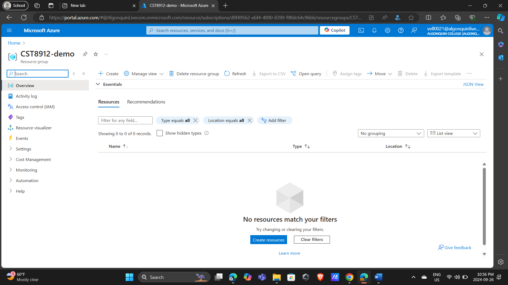 

    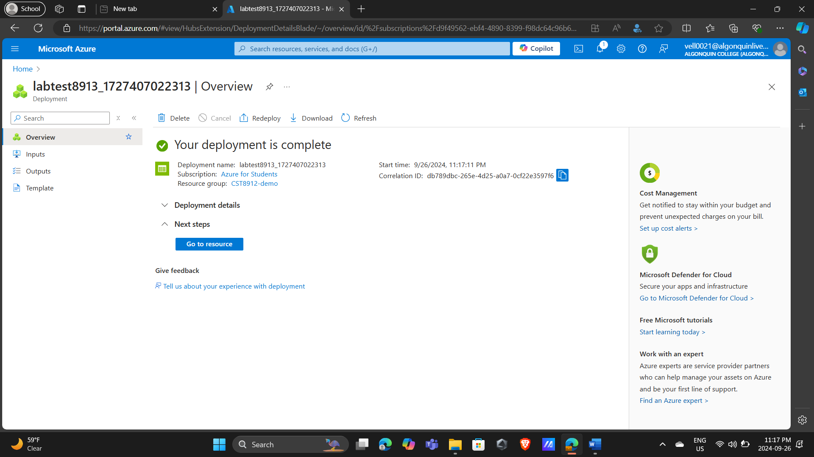 

**2. Change redundancy and set blob access tier**  
   Go to your storage account resource blade, under the data management section, click the **Redundancy** tab. Change redundancy to "Local Redundant Storage (LRS)" from the dropdown. Under **Settings**, choose **Configuration** and set the blob access tier to "Cool", then save the change.  
   _Score: /2_

    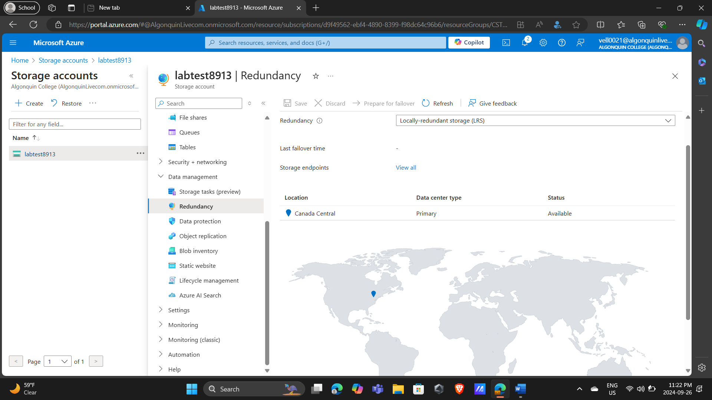  

**3. Create a container and upload a blob**  
   Under **Data Storage** on the left, click **Containers**, then add a new container named `labtestcontainer8912`. Upload a blob, change the advanced settings, and set the access tier to "Hot". Upload the blob to a folder named `sampletest8912`, browsing the sample files shared in this lab. (If you cannot find the sample file link, check with your instructor.)  
   _Score: /6_

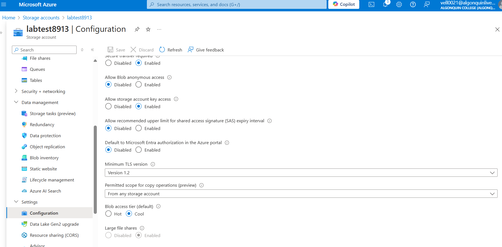  

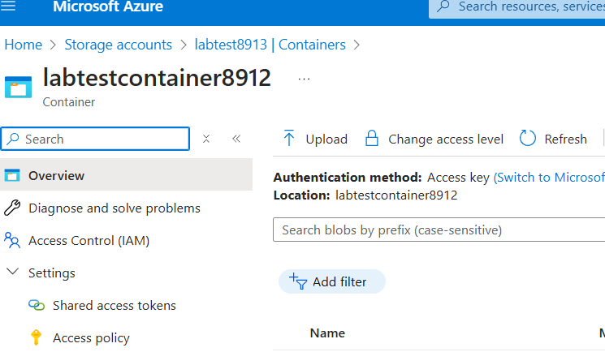 

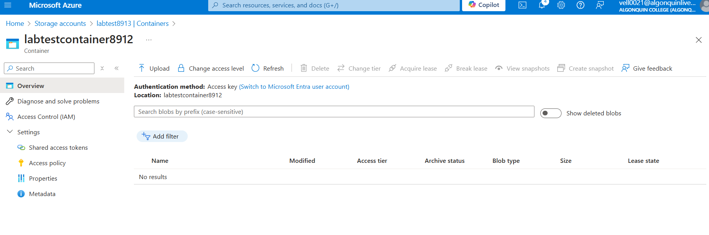  

**4. Test the blob URL**  
   Click the uploaded file in the container to view the configuration options. Copy the blob URL, open a new private browser window, and paste the copied URL.  
   **Note:** The URL should not work, as the container's public access is set to private (resource not found).  
   _Score: /2_

   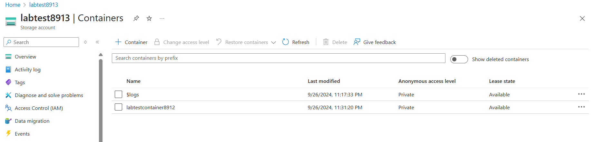  

   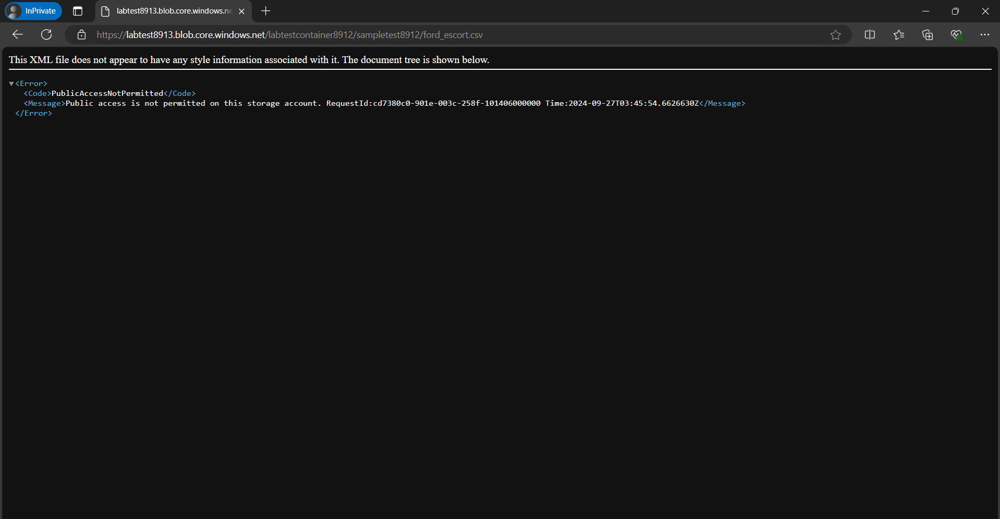  

**5. Generate and test SAS token**  
   On the file blade, click **Generate SAS**, copy the SAS token generated, and paste the blob SAS URL in the private browser window. You should be able to see the file.  
   _Score: /3_

   
   
   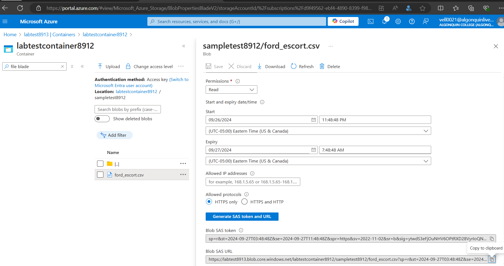 

   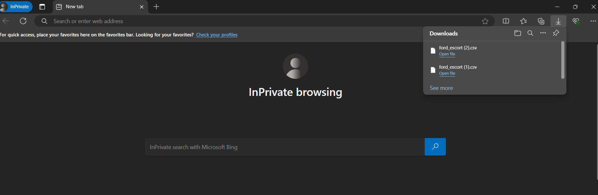 

**6. Set up Lifecycle Management**  
   On the container blade, under the **Data Management** tab, go to **Lifecycle Management**. Create a new rule named `myrule8912`. Set the rule scope to "Limit blobs with filters". Set the blob type and blob subtype to default. Add a condition: if base blobs were last modified more than "15 days" ago, then move them to "Cool Storage".  
   _Score: /4_

   
   
   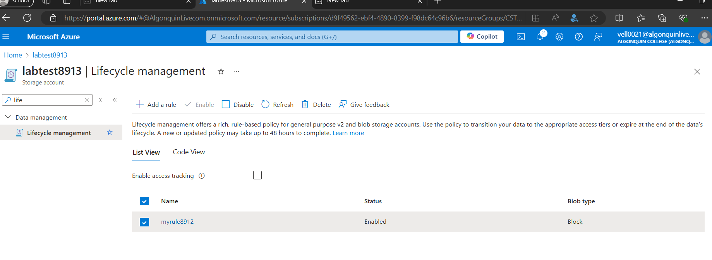  

   
   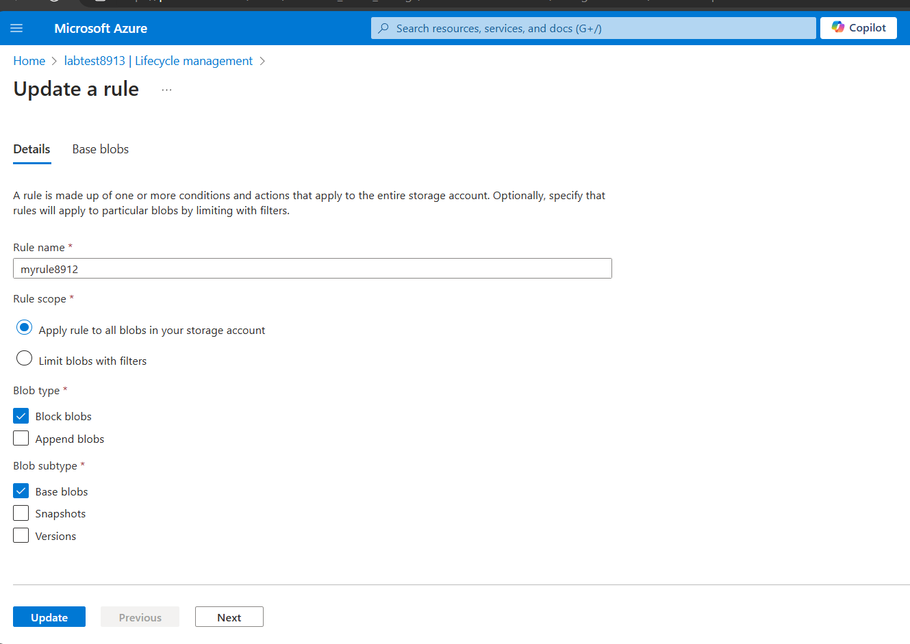  

   
   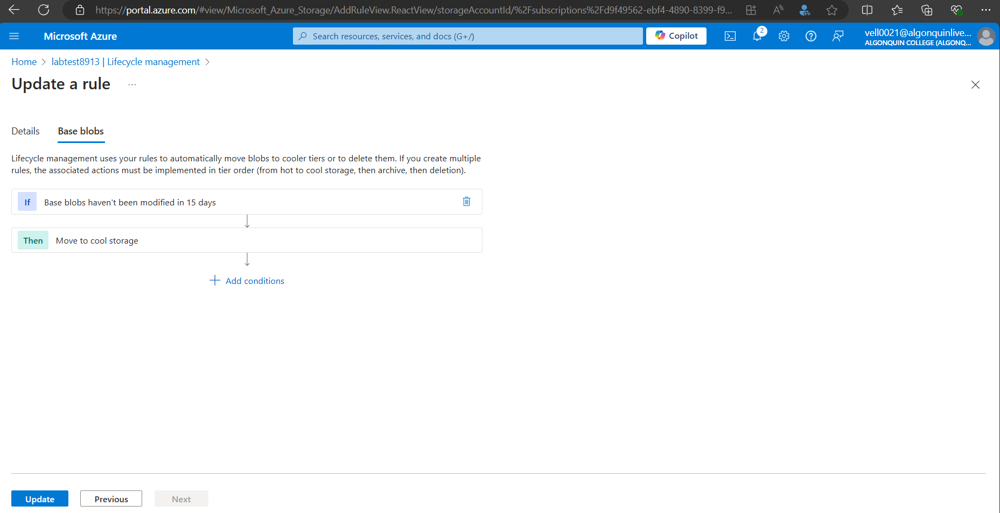  

  
**7. Delete resources and create lab report**  

   After the demo, delete all the resources created during the lab and create a lab report documenting all the steps with screenshots.  
   _Score: /1_

   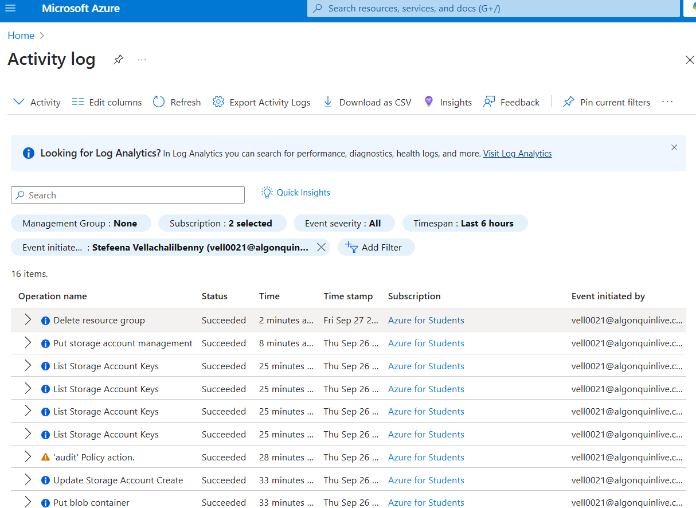  

---

